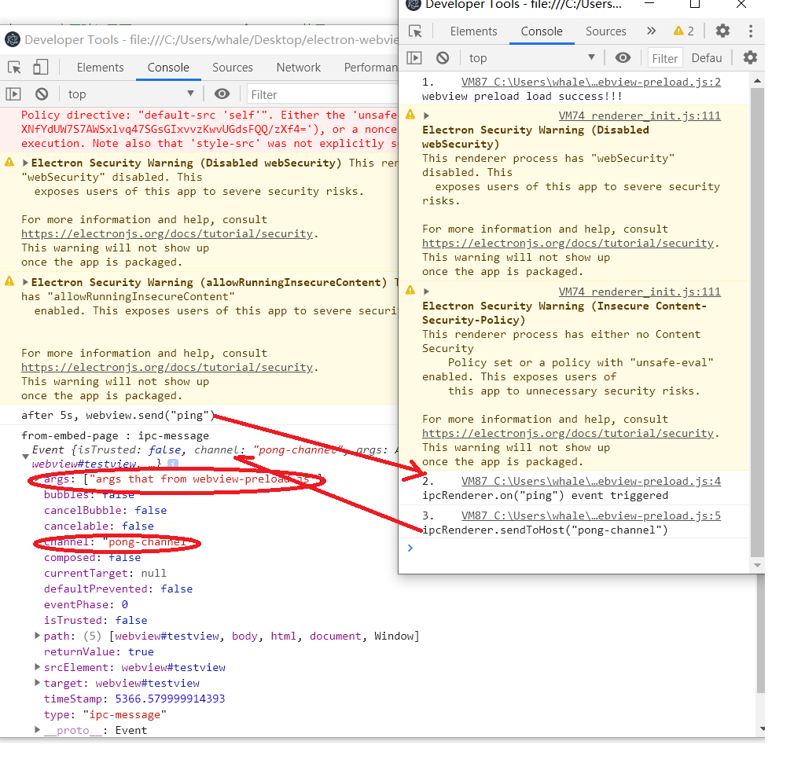

# webviewTag的使用
https://www.electronjs.org/zh/docs/latest/tutorial/quick-start      
https://www.electronjs.org/zh/docs/latest/api/webview-tag#event-ipc-message     

>参考quick-start建了一个demo,主要验证了下electron11.3.0和11.5.0使用webviewTag中event-ipc-message的一些区别

>背景:
> 项目中使用electron11.3.0,在webviewTag下使用event-ipc-message的时候,发现有参数channel,args丢失, 最后推测可能是版本原因,之后升级11.5.0,发现确实如此.
> 属于electron缺陷,11.4.7版本已修复

## reference

https://github.com/electron/electron/pull/26289   
https://releases.electronjs.org/releases/stable?version=11&page=4&limit=2  
https://www.electronjs.org/releases/stable?version=11